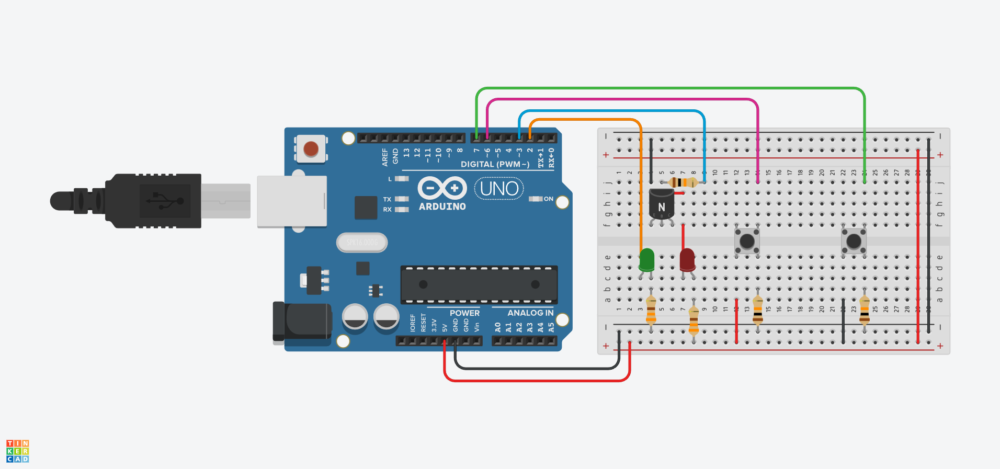
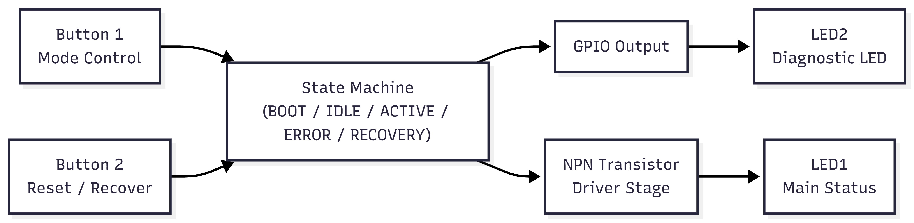
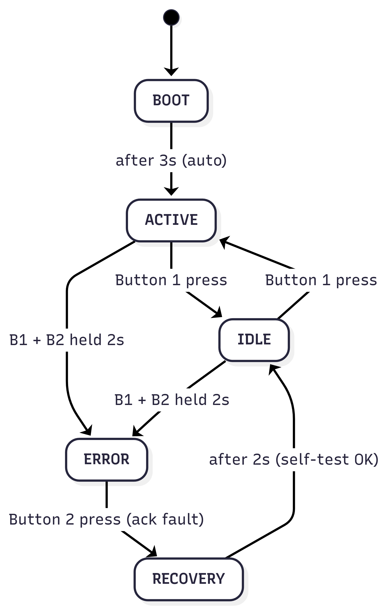

# Non-Blocking FSM-Based Embedded System - 2 (Arduino Uno)

This project demonstrates a non-blocking finite state machine (FSM) implemented on an Arduino Uno, using object-oriented C++, event-driven button handling, and time-based state transitions without using `delay()`.

The goal of this project is not robotics, but to practice embedded systems architecture, clean state management, and scalable firmware design.

## Key Concepts Demonstrated
- Finite State Machine (FSM)
- Non-blocking timing using millis()
- Event-based button handling (edge detection)
- Separation of concerns (LED, Button, StateManager)
- Object-Oriented Design in Embedded C++
- Deterministic control flow (no delays, no blocking loops)

## Hardware Used
|Name	|Quantity	|Component|
|-----|---------|---------|
|U1	  |1	      |Arduino Uno R3|
|D1	  |1	      |Green LED|
|R1  |2	      |330 Ω Resistor|
|S1|2	|Pushbutton|
|R2	|3	|10 kΩ Resistor|
|T1	|1	|NPN Transistor (BJT)|
|D2	|1	|Red LED|

## Diagram

## System States
| State | LED1 (Main) | LED2 (Diag) | Behavior |
| ----- | ----- | ----- | ----- |
| BOOT | Blink slow | OFF | 3 seconds |
| IDLE | OFF | Blink slow | Waiting |
| ACTIVE | ON | OFF | Normal operation |
| ERROR | Blink fast | Blink fast | Fault |
| RECOVERY | OFF | ON | After reset |

### Block Diagram

### State Diagram

All transitions are event-driven and non-blocking.

## Why This Project Exists

### This project was built to:
- Move beyond basic Arduino sketches
- Practice real embedded firmware patterns
- Prepare for bare-metal, RTOS, and low-level system work
- Build GitHub-visible proof of embedded fundamentals

### It intentionally avoids:
- Blocking delays
- Monolithic `loop()` logic
- Hardware-specific hacks

